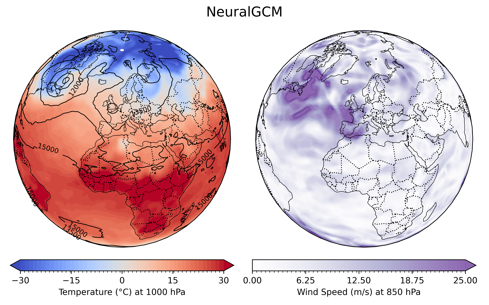
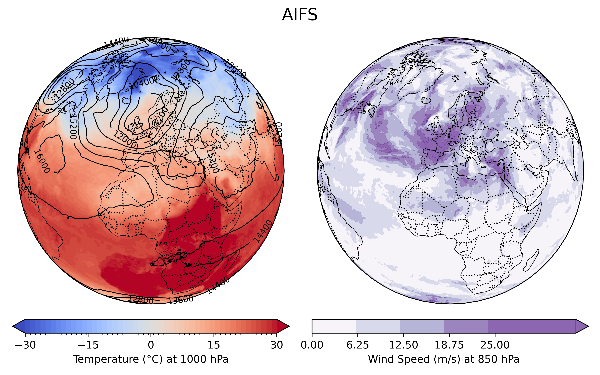

# AIUQ

> ⚠️ **THIS BRANCH IS NOT OPERATIONAL**  
> Use main branch to run the worflow.

> **V0.0.1**  
> This is the first functioning version. Still, the documentation is incomplete and using the framework in a new environment may trigger unexpected errors.

AIUQ (Artificial Intelligence weather forecasting models for Uncertainty Quantification) is a framework for running AI-based weather and climate models using Autosubmit. It is designed to efficiently handle different combinations of initial conditions (ICs) and models. The integration of multiple fallback methods allows the use of different sets of initial conditions, even when they do not fully match the AI model requirements.

The framework supports both deterministic and stochastic models. Deterministic models always produce the same results when initialized with the same ICs, whereas stochastic models are able to generate an ensemble of realizations starting from identical ICs. For this reason, AIUQ also implements several classes of methods to perturb the ICs (still under development), allowing the generation of ensembles of realizations even from deterministic models.

<table><tr><td>
<b>The current implementation supports the following ICs / AI models:</b><br><br>
<table>
<tr>
<th>Model</th>
<th>Checkpoint</th>
<th>ERA5</th>
<th>EERIE (AMIP)</th>
</tr>
<tr>
<td rowspan="6"><b>NeuralGCM</b></td>
<td><a href="https://neuralgcm.readthedocs.io/en/latest/checkpoints.html">stochastic_1_4_deg.pkl</a></td>
<td align="center">✅</td>
<td align="center">✅</td>
</tr>
<tr>
<td><a href="https://neuralgcm.readthedocs.io/en/latest/checkpoints.html">stochastic_precip_2_8_deg.pkl</a></td>
<td align="center">✅</td>
<td align="center">✅</td>
</tr>
<tr>
<td><a href="https://neuralgcm.readthedocs.io/en/latest/checkpoints.html">stochastic_evap_2_8_deg.pkl</a></td>
<td align="center">✅</td>
<td align="center">✅</td>
</tr>
<tr>
<td><a href="https://neuralgcm.readthedocs.io/en/latest/checkpoints.html">deterministic_0_7_deg.pkl</a></td>
<td align="center">✅</td>
<td align="center">✅</td>
</tr>
<tr>
<td><a href="https://neuralgcm.readthedocs.io/en/latest/checkpoints.html">deterministic_1_4_deg.pkl</a></td>
<td align="center">✅</td>
<td align="center">✅</td>
</tr>
<tr>
<td><a href="https://neuralgcm.readthedocs.io/en/latest/checkpoints.html">deterministic_2_8_deg.pkl</a></td>
<td align="center">✅</td>
<td align="center">✅</td>
</tr>
<tr>
<td rowspan="2"><b>AIFS</b></td>
<td><a href="https://huggingface.co/ecmwf/aifs-single-1.1">aifs-single-1.1.ckpt</a></td>
<td align="center">⚠️</td>
<td align="center">⚠️</td>
</tr>
<tr>
<td><a href="https://huggingface.co/ecmwf/aifs-ens-1.0">aifs-ens-crps-1.0.ckpt</a></td>
<td align="center">✅</td>
<td align="center">✅</td>
</tr>
<tr>
<td rowspan="1"><b>MS Aurora</b></td>
<td><a href="https://huggingface.co/microsoft/aurora">aurora-0.25-finetuned</a></td>
<td align="center">❌</td>
<td align="center">❌</td>
</tr>
</table>
</td>
<td style="padding-left:20px; vertical-align:top;">
<b> </b><br><br>
<b> </b><br><br>
✅ available<br>
⚠️ work in progress<br>
❌ not implemented<br>
</td></tr></table>


<p align="center">
  
  
  <br>
  <em>
  NeuralGCM (resolution 1.4°) and AIFS-ens (resolution 0.25°) forecasts for January 21st, 1988.
  Both simulations are initialized on January 1st, 1988, using ERA5 reanalysis data.
  </em>
</p>

## Quickstart

### Installation
To run the framework you need
- Autosubmit in your local machine. Please refer to the [official documentation](https://autosubmit.readthedocs.io/en/master/) to install it.
- The supporting files on your HPC

**Important**: The supporting files must be stored in a folder (from now on <supporting_folder>) which path you will be ask to provide for the execution of the framework.

The supporting files are the following:
```
<supporting_folder>
└── AIUQ  
      ├── models        # Contains the checkpoint for the inference
      ├── sif           # Contains the images for running the scripts
      ├── static        # Contains static (i.e. orography) data for 1st level fallback
      └── climatology   # Contains climatological data used for 2nd level fallback
```

*Section still in development*

### Execution

#### Create the experiment
```
autosubmit expid \
  --description "AIUQ" \
  --HPC MareNostrum5ACC \
  --minimal_configuration \
  --git_as_conf conf/bootstrap/ \
  --git_repo https://github.com/JGrassi97/AIUQ.git \
  --git_branch standard/v010
```

MareNostrum5ACC

#### Run the experiment

Create the file <EXPID>/conf/main.yml. 

```
# <EXPID>/conf/main.yml

MODEL:
  # Main settings
  NAME: neuralgcm                                   # aifs / neuralgcm / aurora
  CHECKPOINT_NAME: stochastic_precip_2_8_deg.pkl    # checkpoint name as written in the table above
  ICS: eerie                                        # eerie / era5
  USE_LOCAL_ICS: false                              # true / false

# See autosubmit documentationcdc
EXPERIMENT:
  MEMBERS: "1 2"
  CHUNKSIZEUNIT: day
  DATELIST: 20100101
  CHUNKSIZE: 2
  NUMCHUNKS: 1
  CALENDAR: standard

  # The following fields are not part of standard Autosubmit experiment
  OUT_VARS:       
    - all                 # If you want to store only a subset of variables - make sure to use the specific out names of the model
  OUT_FREQ: daily         # original / daily
  OUT_RES: "1"              # original / 0.25 / 0.5 / 1 / 1.5 / 2
  OUT_LEVS: [1000, 850, 700, 500, 250, 100, 50, 10]              # List of values in hPa or 'original' - 
  
  # Here reported from https://github.com/PCMDI/cmip6-cmor-tables/blob/087fe45d21c082e28723e0f930e4266abe91b853/Tables/CMIP6_coordinate.json#L1640

PATHS:
  SUPPORT_FOLDER: /gpfs/scratch/ehpc536/AIUQ
  SIF_FOLDER: "%PATHS.SUPPORT_FOLDER%/sif"

PLATFORM:
  NAME: MARENOSTRUM5  # FELIPE / MARENOSTRUM5
```

Note that some ICs requires credential to be retrieved. 
- ERA5  -> Google Cloud Store - No credentials required
- EERIE -> MARS - ECMWF Web API credentials required ([read here](https://www.ecmwf.int/en/computing/software/ecmwf-web-api))

## Developer’s Guide

### Standard

The main challenge in developing and maintaining the framework is handling the different specifications required by each IC and AI model, such as naming conventions, grids, pressure levels, etc. Hardcoding every possible combination quickly leads to an unmanageable number of cases.

To address this issue, the framework adopts a standard convention called **AIUQ-st**:

- ICs are always saved, retrieved, and temporarily restored according to the AIUQ-st standard.
- AI models always perform inference starting from data formatted in the AIUQ-st standard.

Since this standard may evolve due to future developments or different user requirements, it is versioned. Each version is stored under `docs/AIUQ-st/version`.

**Note:** Developers are responsible for keeping the codebase as modular as possible in order to remain independent of any single AIUQ-st convention.

---

#### AIUQ-st v000

Below is a brief description of **AIUQ-st/v000**:

- **Storage format:** `.zarr`
- **Naming conventions:** [ECMWF Parameter database](https://codes.ecmwf.int/grib/param-db/?encoding=netcdf)
- **Coordinates:** latitude / longitude / time / level
- **Grid:** regular latitude–longitude grid with 0.25° × 0.25° resolution  
  - latitude range: −90° to 90° N  
  - longitude range: 0° to 360° E

In practice, developers who aim to introduce a new initial condition (IC) must provide the code required to retrieve and store the ICs according to the AIUQ-st convention. They should also strive to keep the implementation modular in order to remain resilient to future changes in the standard.

To support this process, the framework provides a set of standard options, utility functions, and best practices. Before proceeding, developers are strongly encouraged to carefully read the relevant Wiki pages.
